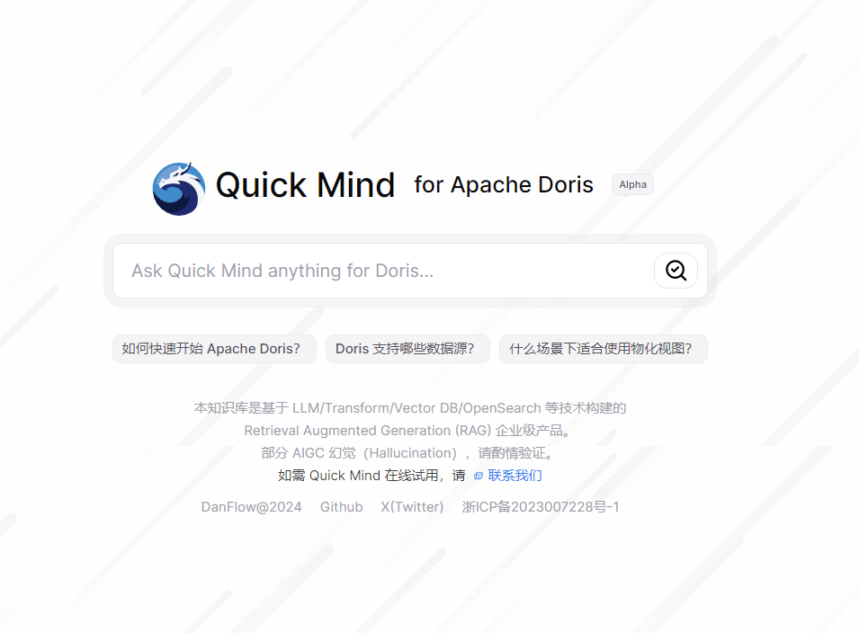

# quick-mind-doris


## 启动 server
- 填写 OpenAI API Key 后启动：
```shell
export OPENAI_API_KEY=sk-xxxxxx
python app.py
```
## 启动 web-client
- 创建 .env.local 文件，填写上面已启动的 sever URL，和 多轮对话 URL，例如：
```shell
BOT_URL="http://qmbot.kittygpt.cn:8088"
SEARCH_SERVER_URL="http://qms.kittygpt.cn:8088"
```
- 启动 web-client (dev模式)
```shell
cd web
npm install
npm run dev
```

- 编译启动 web-client
```shell
npm run build
npm run start
```
## Features

- Co-reference resolution(指代消解), rolling up 3 chat histories with LLM
- Double hits, both index match(vector search) and symantic search(elasticsearch)
- Metadata filter，e.g. version
- 目前支持 Self-host Model：chatglm-6b

## Roadmap

- [ ] Management backend
- [ ] Desktop App with tauri
- [ ] User login, accounts
...


## Get Started
[TODO]


## LICENSE

[Anti 996 License](https://github.com/kattgu7/Anti-996-License/blob/master/LICENSE_CN_EN)